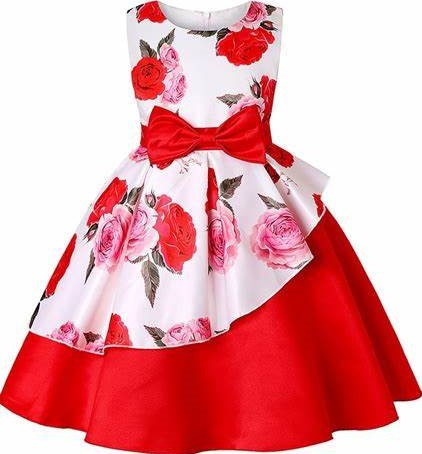
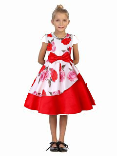

# Dress Up AI - Virtual Outfit Try-On

## Overview
Dress Up AI is a Python-based project that utilizes a **U-Net** model for dress segmentation. The project enables users to virtually try on different outfits by detecting and masking existing clothing, creating a bounding box, resizing the selected outfit, and overlaying it on the user’s image.

## Features
- **Dress Segmentation**: Uses a **U-Net** model (`Unet_2020-10-30`) to generate a mask of the dress.
- **Bounding Box Detection**: Identifies the last edges of the mask in all four directions to create a bounding box.
- **Outfit Resizing**: Resizes the selected dress to fit within the detected bounding box.
- **Dress Overlaying**: Places the given dress onto the masked area of the image.

## Input & Output
- **Input**:  
  - .jpeg)  
    *(Image of a person wearing a dress)*
  -   
    *(Dress to be applied)*
- **Output**:  
  -   
    *(Final image with the applied dress)*

